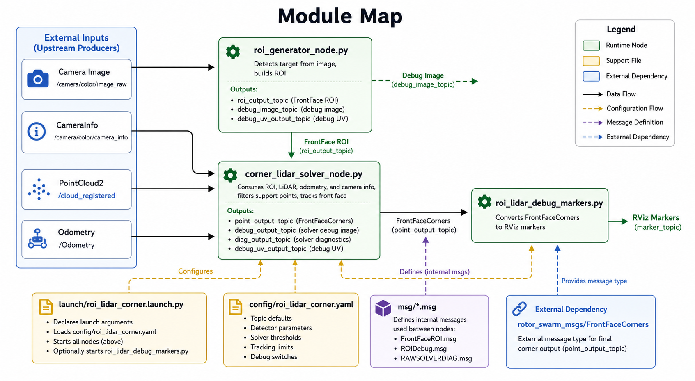
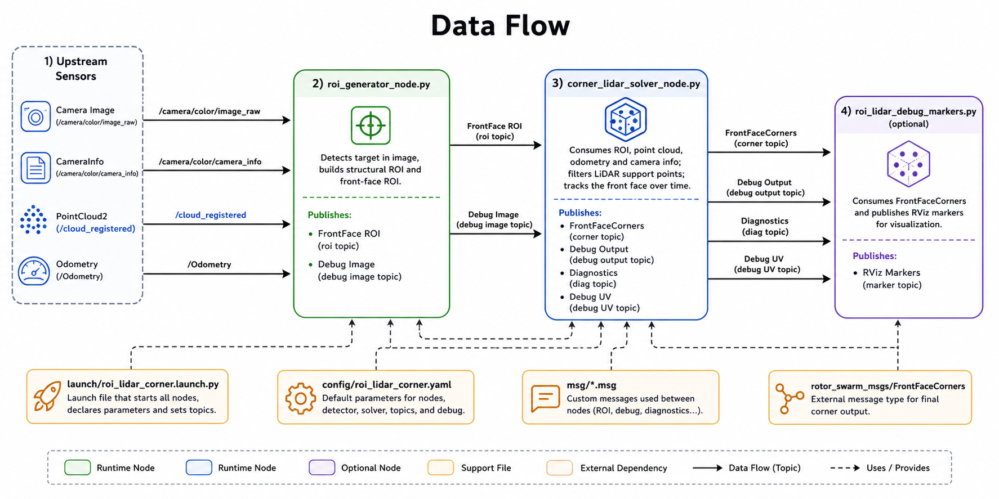

# ROI LiDAR Corner

This repository is now an ROI-only ROS 2 workspace centered on the standalone package:

```text
src/roi_lidar_corner
```

The package consumes upstream image, camera info, point cloud, and odometry topics, then publishes ROI and front-face corner outputs. FAST-LIO and Livox are no longer part of this repository; if needed, run them from external workspaces as upstream data producers.

## Expected Inputs

Default topics:

- point cloud: `/cloud_registered`
- odometry: `/Odometry`
- image: `/camera/color/image_raw`
- camera info: `/camera/color/camera_info`

These can be overridden through `roi_lidar_corner.launch.py` arguments or the package config.

## Build And Launch

```bash
colcon list
colcon build --symlink-install --packages-select roi_lidar_corner
source install/setup.bash
ros2 launch roi_lidar_corner roi_lidar_corner.launch.py
```

## Nodes And Workflow

The standalone ROI package runs three runtime nodes from `src/roi_lidar_corner/roi_lidar_corner/` and wires them together through `src/roi_lidar_corner/launch/roi_lidar_corner.launch.py`.

### Diagrams

#### Module Map



#### Data Flow



### Runtime Nodes

- `roi_generator_node.py`
  - Main file: `src/roi_lidar_corner/roi_lidar_corner/roi_generator_node.py`
  - Role: consumes the image stream, runs the detector, builds structure/front-face ROI messages, and publishes the ROI outputs.
  - Key inputs: `image_topic`, detector settings, ROI refinement parameters.
  - Key outputs: `roi_output_topic`, `point_output_topic`, `debug_image_topic`, `debug_uv_output_topic`.

- `corner_lidar_solver_node.py`
  - Main file: `src/roi_lidar_corner/roi_lidar_corner/corner_lidar_solver_node.py`
  - Role: consumes ROI, point cloud, odometry, and camera info; filters LiDAR support points; tracks the front face; and publishes the final 3D corner solution and debug topics.
  - Key inputs: `roi_topic`, `pointcloud_topic`, `odom_topic`, `camera_info_topic`.
  - Key outputs: `point_output_topic`, `debug_output_topic`, `diag_output_topic`, `debug_uv_output_topic`.

- `roi_lidar_debug_markers.py`
  - Main file: `src/roi_lidar_corner/roi_lidar_corner/roi_lidar_debug_markers.py`
  - Role: optional visualization node that converts `FrontFaceCorners` into RViz `MarkerArray` output.
  - Key inputs: `corner_topic`.
  - Key outputs: `marker_topic`.

### Support Files

- Launch wiring: `src/roi_lidar_corner/launch/roi_lidar_corner.launch.py`
  - Declares launch arguments.
  - Loads `config/roi_lidar_corner.yaml`.
  - Starts `roi_generator_node`, `corner_lidar_solver_node`, and optionally `roi_lidar_debug_markers`.

- Runtime defaults: `src/roi_lidar_corner/config/roi_lidar_corner.yaml`
  - Stores topic defaults, detector settings, solver thresholds, tracking limits, and debug toggles.

- Message definitions: `src/roi_lidar_corner/msg/*.msg`
  - Defines the package-local ROI and debug messages used between nodes.

- External corner message dependency: `rotor_swarm_msgs/FrontFaceCorners`
  - The final corner output message is provided by the external message package referenced in `package.xml`.

### Basic Workflow

1. `roi_generator_node` subscribes to the camera image and produces front-face ROI candidates and optional debug overlays.
2. `corner_lidar_solver_node` subscribes to the ROI stream, the upstream point cloud, odometry, and camera info.
3. The solver matches LiDAR points to the ROI, tracks the front face over time, and publishes the final `FrontFaceCorners` result plus solver diagnostics.
4. `roi_lidar_debug_markers` can subscribe to `FrontFaceCorners` and publish RViz markers for visualization.
5. Optional debug-image tooling such as `roi_lidar_debug_view.py` can subscribe to the debug image topic for offline inspection, but it is not part of the default launch chain.

## Verification

```bash
colcon list --packages-select roi_lidar_corner
python3 -m py_compile src/roi_lidar_corner/launch/*.py src/roi_lidar_corner/roi_lidar_corner/*.py
python3 -m pytest src/roi_lidar_corner/tests
```

## Legacy Integration Archive

Legacy FAST-LIO/Livox integration reference files are retained under:

```text
archive/fastlio_integration
```

Those files are non-runtime reference material only. They are not maintained launch entrypoints for this repository.
